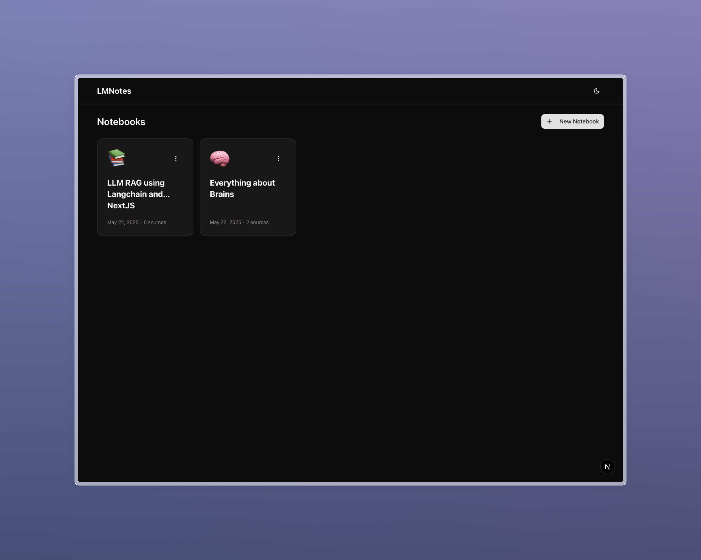
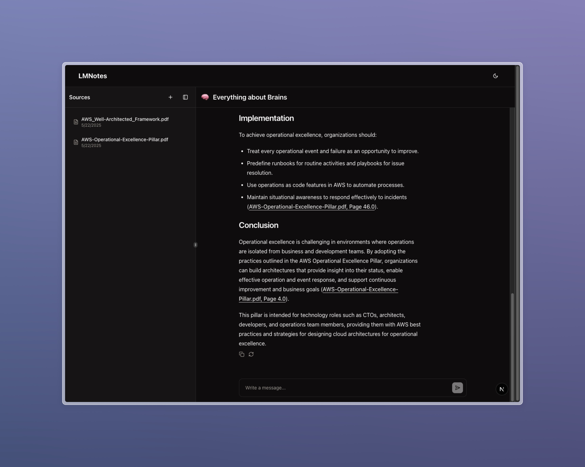

# LM Notes - NotebookLM Demonstration

A demonstration implementation of Google's NotebookLM concept, built with modern web technologies. This project showcases how to create an AI-powered note-taking application that can understand, analyze, and interact with your notes in a conversational way.




## About

This project is a demonstration of the NotebookLM concept, which combines document understanding with conversational AI. It allows users to:

- Upload and manage documents
- Have natural conversations about the content
- Get AI-powered insights and summaries
- Search through documents using semantic understanding

## Key Technologies

- **Frontend**:

  - Next.js 15 with React 19
  - [assistant-ui](https://github.com/assistant-ui/assistant-ui) for AI chat interface
  - Tailwind CSS for styling
  - Radix UI for accessible components

- **AI & Processing**:

  - OpenAI's GPT models for conversation and understanding
  - LangChain for AI workflow orchestration
  - Pinecone for vector storage and semantic search

- **Backend**:
  - FastAPI for the API layer
  - PostgreSQL for data storage
  - Drizzle ORM for database management

## Project Structure

The project is organized into two main components:

- `web/`: Frontend application built with Next.js
- `api/`: Backend API service built with Python FastAPI

## Features

- Modern, responsive UI with AI chat interface
- Document upload and management
- Real-time AI-powered conversations about your notes
- Semantic search capabilities
- Vector storage for efficient document retrieval
- Docker support for easy deployment

## Prerequisites

- Node.js (v18 or higher)
- Python 3.11+
- PostgreSQL
- Docker and Docker Compose (for containerized deployment)

## Environment Variables

### Frontend (.env in web directory)

```env
NEXT_PUBLIC_API_URL=http://localhost:8000
NODE_ENV=production
NEXT_TELEMETRY_DISABLED=1
```

### Backend (.env in api directory)

```env
# Database Configuration
DATABASE_URL=postgresql://postgres:postgres@db:5432/lmnotes

# OpenAI Configuration
OPENAI_API_KEY=your_openai_api_key

# Pinecone Configuration
PINECONE_API_KEY=your_pinecone_api_key
PINECONE_ENVIRONMENT=your_pinecone_environment
PINECONE_INDEX_NAME=your_pinecone_index_name

# Python Environment
PYTHONPATH=/app
PYTHONDONTWRITEBYTECODE=1
PYTHONUNBUFFERED=1
```

## Getting Started

### Local Development Setup

#### Frontend Setup

1. Navigate to the frontend directory:

   ```bash
   cd web
   ```

2. Install dependencies:

   ```bash
   pnpm install
   ```

3. Set up environment variables:
   Create a `.env` file in the `web` directory with the necessary environment variables.

4. Start the development server:
   ```bash
   pnpm dev
   ```

#### Backend Setup

1. Navigate to the API directory:

   ```bash
   cd api
   ```

2. Create and activate a virtual environment:

   ```bash
   python -m venv .venv
   source .venv/bin/activate  # On Windows: .venv\Scripts\activate
   ```

3. Install dependencies:

   ```bash
   pip install -r requirements.txt
   ```

4. Start the API server:
   ```bash
   uvicorn app.main:app --reload
   ```

### Docker Deployment

1. Create the required `.env` files:

   - Create `web/.env` with frontend environment variables
   - Create `api/.env` with backend environment variables

2. Build and start the containers:

   ```bash
   docker-compose up --build
   ```

3. Access the services:

   - Frontend: http://localhost:3000
   - Backend API: http://localhost:8000
   - Database: localhost:5432

4. To stop the services:

   ```bash
   docker-compose down
   ```

5. To view logs:
   ```bash
   docker-compose logs -f
   ```

## Development

### Database Management

The project uses Drizzle ORM for database management. Available commands:

```bash
# Generate database migrations
pnpm db:generate

# Push migrations to database
pnpm db:push

# Open Drizzle Studio
pnpm db:studio
```

### Docker Development

The project includes Docker configuration for both frontend and backend services. The setup includes:

- Multi-stage builds for optimized images
- Automatic database migrations on startup
- Environment variable management
- Health checks for service dependencies

## Tech Stack

### Frontend

- Next.js 15
- React 19
- Tailwind CSS
- Radix UI Components
- Drizzle ORM
- TypeScript

### Backend

- FastAPI
- PostgreSQL
- Python 3.11+
- OpenAI API
- Pinecone Vector Database

## Required API Keys and Services

To run the application, you'll need to obtain the following:

1. **OpenAI API Key**

   - Visit [OpenAI Platform](https://platform.openai.com)
   - Create an account and generate an API key
   - Add the key to `api/.env` as `OPENAI_API_KEY`

2. **Pinecone Account and API Key**
   - Visit [Pinecone](https://www.pinecone.io)
   - Create an account and create a new project
   - Generate an API key
   - Create an index for vector storage
   - Add the following to `api/.env`:
     - `PINECONE_API_KEY`
     - `PINECONE_ENVIRONMENT`
     - `PINECONE_INDEX_NAME`

## Contributing

This is a demonstration project, but contributions are welcome! If you'd like to contribute:

1. Fork the repository
2. Create your feature branch (`git checkout -b feature/amazing-feature`)
3. Commit your changes (`git commit -m 'Add some amazing feature'`)
4. Push to the branch (`git push origin feature/amazing-feature`)
5. Open a Pull Request

## License

This project is licensed under the MIT License - see the LICENSE file for details.

## Acknowledgments

- Inspired by Google's [NotebookLM](https://notebooklm.google.com)
- Built with [assistant-ui](https://github.com/assistant-ui/assistant-ui)
- Uses [LangChain](https://github.com/langchain-ai/langchain) for AI workflows
